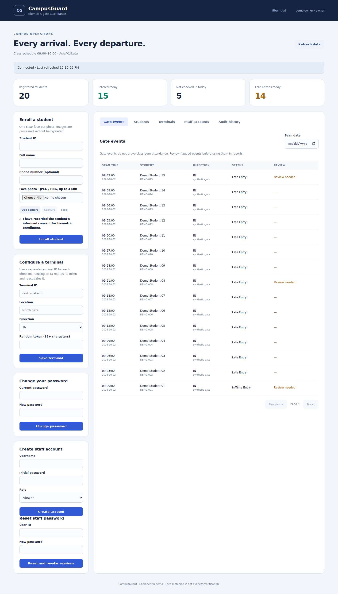

# CampusGuard

Biometric **gate attendance** with a FastAPI dashboard, PostgreSQL transactions,
individual staff accounts and encrypted offline delivery. Built as an
AI-assisted engineering portfolio project by Shinjan Poddar.

**Release 4.0 · schema v3.** This package implements staff authentication,
permissions, deployment automation, monitoring and recovery utilities.
It is ready for source review and GitHub publication. Real camera accuracy,
presentation-attack resistance, public certificates and deployment capacity
still require validation. See [the validation report](docs/VALIDATION.md).



## Features

- Individual owner, operator and viewer accounts; Argon2id password hashing.
- Expiring, database-backed sessions; immediate revocation after password,
  role or account changes; browser HttpOnly cookies and CSRF checks.
- Attributed audit records, shared login throttling and last-owner protection.
- Explicit IN/OUT terminals and configurable 09:00–16:00 campus schedule.
- Atomic attendance and retry receipts, concurrent cooldown protection,
  unique event IDs and replay conflict detection.
- Encrypted biometric templates, optional phone fields and durable terminal
  queues. Photos are processed without deliberate permanent storage.
- Responsive dashboard, webcam/photo enrollment, paginated records,
  staff account management, password changes and audit history.
- Container image, database migration, separate API database role, Caddy
  HTTPS proxy and health-gated deployment with a pre-upgrade encrypted backup.
- Protected Prometheus metrics, bounded metric labels, JSON request logs
  and alert rules. Alert notification destinations are configured separately.
- PostgreSQL integration, recovery, permission, security and queue tests;
  GitHub Actions, release-image workflow and Dependabot configuration.

## Quick start on Windows

Use Python 3.12 and PostgreSQL 17 or 18. Create a new database named
`campusguard`. Your local database owner can initialize it; production uses a
separate limited API role.

```powershell
py -3.12 -m venv .venv
.\.venv\Scripts\python.exe -m pip install -r requirements-dev.txt
Copy-Item .env.example .env
.\.venv\Scripts\python.exe -m scripts.generate_secrets
```

Edit `.env` privately: set your real `DATABASE_URL`, a generated
`BIOMETRIC_ENCRYPTION_KEY` and `METRICS_TOKEN`. Store a generated
`BACKUP_ENCRYPTION_KEY` separately if using the backup utility. Keep all secrets
out of GitHub.

```powershell
.\.venv\Scripts\python.exe -m scripts.init_db
.\.venv\Scripts\python.exe -m scripts.create_admin shinjan --role owner
.\.venv\Scripts\python.exe -m uvicorn app.main:create_app --factory --host 127.0.0.1 --port 8000 --no-access-log
```

Open `http://127.0.0.1:8000` and sign in with the account you created. Use exactly
the origin configured in `PUBLIC_ORIGIN`; browser mutation requests from other
origins are rejected. Passwords are entered at a hidden console prompt; there
are no default accounts or hard-coded passwords. The old shared admin-token
header is no longer accepted.

For Linux/macOS, use `python3 -m venv .venv`, then `source .venv/bin/activate` and
`python` for the same module commands. The local database-only Docker option is
`docker compose up -d db` after setting `POSTGRES_PASSWORD`; it binds PostgreSQL
only to loopback. See [deployment instructions](docs/DEPLOYMENT.md) for the full
stack.

**Photo enrollment requires the optional native face stack:** install
`requirements-server.txt` on the API host. Dlib may need CMake and a C++ compiler,
particularly on Windows. The base API intentionally remains usable for trusted
terminal vectors without that stack. The production image builds it by default.

## Staff permissions

| Capability | Viewer | Operator | Owner |
|---|:---:|:---:|:---:|
| Dashboard, students and gate logs | ✓ | ✓ | ✓ |
| Student phone numbers | — | ✓ | ✓ |
| Enroll/delete students | — | ✓ | ✓ |
| View terminals | — | ✓ | ✓ |
| Configure/revoke terminals | — | — | ✓ |
| Manage accounts and read audit history | — | — | ✓ |
| Change own password | ✓ | ✓ | ✓ |

Owners create accounts from the dashboard. Every role/account update or password
reset revokes that user's sessions. At least one active owner must remain.
For console recovery use `python -m scripts.create_admin USER --reset-password`;
this resets a password and reactivates the account without changing its role.
Console access is a trusted operational capability, not a browser bypass.

## Camera terminals

On each terminal machine install `requirements-biometric.txt` and copy
`.env.terminal.example` to `.env.terminal`. Configure the API HTTPS URL, terminal
ID/token/direction and a separate generated queue encryption key. Register that
terminal in the owner dashboard first. Use a separate identity for each direction.

```powershell
.\.venv\Scripts\python.exe terminal.py
.\.venv\Scripts\python.exe offline_sync.py --status
.\.venv\Scripts\python.exe offline_sync.py --once
```

Q/Escape stops capture. A face must leave the camera view for two seconds before
another capture. The queue persists before transmission, retries with backoff
and removes events only after a valid acknowledgement. Failed authentication
preserves the queue; permanent request failures are quarantined. An offline
capture is not accepted attendance until the server acknowledges it. Do not
change direction while events remain queued. Synchronize terminal clocks.

`enroll.py` offers CLI webcam enrollment using an individual staff login.

## Event rules

| Event in campus timezone | Recorded status |
|---|---|
| IN at or before class start | In-Time Entry |
| IN after start and before end | Late Entry |
| IN at/after class end | After Scheduled Hours |
| OUT before class end | Early Exit |
| OUT at/after class end | Exit |

Set `CLASS_END=15:00` for a 3 PM finish and restart the API. Existing statuses are
historical records. Unusual order, repeated direction and first-OUT events are
flagged for review. Gate entry does not prove classroom attendance or occupancy.
Overnight schedules are not supported.

## Verification

```sh
python -m pip install -r requirements-dev.txt
python -m pytest -q -rs
python -m compileall -q app clients scripts
npm ci
npm run test:smoke
```

Set `TEST_DATABASE_URL` to a **disposable PostgreSQL database** to execute
integration tests. Its role needs schema, role and database creation privileges;
never point tests at live data. Matching `pg_dump` and `pg_restore` must be on PATH
for recovery tests. Without these, integration/recovery tests skip explicitly.
The CI workflow supplies PostgreSQL 17 and matching tools from its container.
Node.js 24 is needed only for SQL/DOM development smoke checks.

The included load utility sends synthetic vectors:

```sh
python -m scripts.load_test --requests 100 --concurrency 8 --confirm-disposable-target
```

Configure a disposable target in `.env.terminal` first. Its results measure that
specific synthetic workload, not camera accuracy or supported campus capacity.

## Existing installations

For the v2 schema shipped in the earlier package, stop collectors and the API,
back up the database and keys, then run `python -m scripts.migrate` and create
individual accounts. The upgrade preserves students, templates, attendance,
terminals and receipts. It is additive and idempotent; it does not restore the
shared admin token. See [migration instructions](docs/MIGRATION.md).

For older plaintext/legacy schemas, use a new database and the reviewed import
workflow. Do not apply the new schema over an existing database.

## Repository guide

| Path | Purpose |
|---|---|
| `app/` | API, account/session permissions, transactions and metrics |
| `static/` | Dashboard; self-hosted JS/CSS, no frontend CDN dependency |
| `clients/` | Camera capture, enrollment and encrypted SQLite queue |
| `migrations/` | Additive v2 → v3 upgrade |
| `scripts/` | Setup, account recovery, backup, deployment and load tools |
| `deploy/` | HTTPS proxy, monitoring configuration and alert rules |
| `tests/` | Meaningful unit, PostgreSQL, permissions and recovery checks |
| `docs/DEPLOYMENT.md` | Deployment, backups, recovery and monitoring operations |
| `docs/ARCHITECTURE.md` | ACID, encryption, consistency and system-design tradeoffs |
| `docs/VALIDATION.md` | Checks actually run and their limits |
| `docs/GITHUB.md` | Publication commands, repository description and post text |

Read [SECURITY.md](SECURITY.md) before a real pilot. RabbitMQ, DynamoDB and a CDN
are not necessary for the current workload; their absence is explained in the
architecture document. Adding services alone would not demonstrate reliability.

No GitHub repository has been created or pushed by preparing this package.
No open-source license has been chosen; select one before advertising it as
open source or inviting redistribution.
